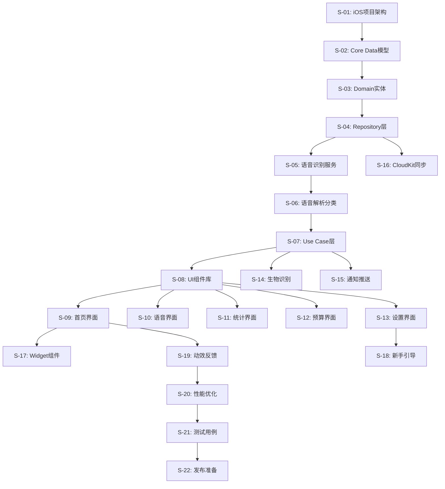

# 自动化开发队列 (Automated Development Queue)
# VoiceBudget - 极简语音记账App

## 📋 Epic (史诗)
**交付一个完整可用的iOS语音记账应用，支持语音/手动记账、预算管理、数据统计和云端同步功能，满足快速记账和引导式预算管理的核心需求。**

---

## 🚀 User Stories (原子任务队列)

### Phase 1: 基础架构层 (Foundation Layer)

#### S-01: 创建iOS项目和基础架构
**标题**: 建立iOS项目骨架和基础配置

**技术规格**:
- 创建新的iOS项目: `VoiceBudget.xcodeproj`
- 配置`Info.plist`: 添加麦克风权限、Face ID权限、CloudKit权限
- 创建文件夹结构:
  - `App/` - 应用入口
  - `Presentation/` - UI层  
  - `Domain/` - 业务逻辑层
  - `Data/` - 数据层
  - `Infrastructure/` - 基础服务层
  - `Resources/` - 资源文件
- 创建`App.swift`作为应用入口点
- 配置SwiftUI生命周期

**验收标准**:
- [ ] 项目能在Xcode中正常打开和编译
- [ ] 应用能在iOS 14.0+设备上成功启动
- [ ] Info.plist包含必要的权限声明
- [ ] 文件夹结构按照Clean Architecture规范创建

---

#### S-02: 实现Core Data数据模型
**标题**: 建立Core Data数据模型和实体关系

**技术规格**:
- 创建`VoiceBudgetModel.xcdatamodeld`
- 定义实体类:
  - `Transaction` (记账记录)
  - `Budget` (预算)
  - `BudgetCategory` (预算分类)
  - `CategoryKeyword` (分类关键词映射)
  - `Achievement` (成就)
  - `UserPreference` (用户偏好)
  - `TransactionModification` (修改历史)
- 配置实体关系和约束
- 创建`CoreDataStack.swift`管理数据栈
- 创建`Transaction+CoreDataClass.swift`等实体扩展

**验收标准**:
- [ ] Core Data模型文件正确定义所有实体和关系
- [ ] CoreDataStack能成功初始化NSPersistentContainer
- [ ] 支持CloudKit同步配置
- [ ] 实体类能正确进行CRUD操作

---

#### S-03: 建立Domain层实体和协议
**标题**: 定义业务领域实体和Repository协议

**技术规格**:
- 创建Domain实体:
  - `TransactionEntity.swift`
  - `BudgetEntity.swift` 
  - `CategoryEntity.swift`
  - `AchievementEntity.swift`
- 创建Repository协议:
  - `TransactionRepository.swift`
  - `BudgetRepository.swift`
  - `UserPreferenceRepository.swift`
- 定义业务规则和约束
- 创建值对象和枚举类型

**验收标准**:
- [ ] 所有Domain实体都有完整的属性定义
- [ ] Repository协议定义了必要的CRUD方法
- [ ] 实体包含业务验证逻辑
- [ ] 支持Codable协议用于序列化

---

#### S-04: 实现Repository层数据访问
**标题**: 实现Core Data Repository具体实现

**技术规格**:
- 创建Repository实现类:
  - `CoreDataTransactionRepository.swift`
  - `CoreDataBudgetRepository.swift`
  - `UserDefaultsPreferenceRepository.swift`
- 实现数据映射逻辑 (Core Data <-> Domain Entity)
- 添加错误处理和日志记录
- 实现数据验证和约束检查

**验收标准**:
- [ ] Repository能正确执行CRUD操作
- [ ] 数据映射无丢失和类型错误
- [ ] 包含完整的错误处理机制
- [ ] 支持异步操作和Combine发布者

---

### Phase 2: 核心业务逻辑层 (Business Logic Layer)

#### S-05: 实现语音识别服务
**标题**: 集成iOS Speech Framework实现语音转文本

**技术规格**:
- 创建`SpeechRecognitionService.swift`
- 实现权限请求逻辑
- 配置实时语音识别
- 创建`SpeechRecognitionResult`结果模型
- 添加识别状态管理和错误处理

**验收标准**:
- [ ] 能请求并获取麦克风权限
- [ ] 支持实时语音识别和文本返回
- [ ] 识别准确率在安静环境下>85%
- [ ] 包含网络异常和权限失败的处理逻辑

---

#### S-06: 实现语音解析和智能分类
**标题**: 解析语音文本并智能匹配消费分类

**技术规格**:
- 创建`VoiceParser.swift`解析语音文本
- 实现金额、分类、时间、备注的提取算法
- 创建`CategoryMatcher.swift`智能分类匹配
- 构建分类关键词映射表
- 实现`ParsedTransaction`结果模型

**验收标准**:
- [ ] 能从"午餐花了38块"中正确提取¥38.00和餐饮分类
- [ ] 支持"昨天"、"前天"的时间识别
- [ ] 关键词匹配准确率>80%
- [ ] 处理模糊匹配和多义词情况

---

#### S-07: 实现Use Case业务逻辑层
**标题**: 创建业务用例处理核心逻辑流程

**技术规格**:
- 创建Use Cases:
  - `CreateTransactionUseCase.swift` - 创建记账记录
  - `ProcessVoiceInputUseCase.swift` - 处理语音输入
  - `GetBudgetStatusUseCase.swift` - 获取预算状态
  - `TrackAchievementUseCase.swift` - 成就追踪
- 实现业务规则验证
- 添加预算检查和警告逻辑
- 集成Repository层数据访问

**验收标准**:
- [ ] CreateTransactionUseCase能完整创建记录并更新预算
- [ ] ProcessVoiceInputUseCase能处理语音到记录的完整流程
- [ ] 预算超支时能正确返回警告信息
- [ ] Use Cases通过依赖注入获取Repository

---

### Phase 3: 用户界面层 (Presentation Layer)

#### S-08: 创建基础UI组件和样式系统
**标题**: 建立SwiftUI组件库和设计系统

**技术规格**:
- 创建共用组件:
  - `CategoryPicker.swift` - 分类选择器
  - `BudgetProgressView.swift` - 预算进度条
  - `AchievementBadge.swift` - 成就徽章
- 定义颜色系统和字体规范
- 创建`VBColor.swift`和`VBFont.swift`常量文件
- 实现可复用的卡片和按钮样式

**验收标准**:
- [ ] 组件能在不同尺寸设备上正确显示
- [ ] 颜色和字体符合设计规范
- [ ] 支持Dark Mode适配
- [ ] 组件具有良好的可访问性支持

---

#### S-09: 实现首页主界面
**标题**: 创建记账首页和核心交互界面

**技术规格**:
- 创建`HomeView.swift`主页面
- 创建`HomeViewModel.swift`数据绑定
- 实现今日统计卡片显示
- 添加最近记录列表
- 创建悬浮语音记账按钮
- 实现Tab栏导航结构

**验收标准**:
- [ ] 首页能正确显示今日支出和剩余预算
- [ ] 记录列表支持左滑删除和点击编辑
- [ ] 语音按钮有清晰的视觉反馈
- [ ] Tab栏能正确切换不同页面

---

#### S-10: 实现语音记账弹窗界面
**标题**: 创建语音识别和记录确认交互界面

**技术规格**:
- 创建`VoiceInputView.swift`语音输入界面
- 创建`VoiceInputViewModel.swift`处理语音识别逻辑
- 实现实时语音波形显示
- 添加识别结果编辑功能
- 创建确认和取消操作流程

**验收标准**:
- [ ] 点击语音按钮能弹出语音识别界面
- [ ] 实时显示识别的文本内容
- [ ] 用户能修改金额、分类等解析结果
- [ ] 确认后能成功创建记账记录

---

#### S-11: 实现统计分析页面
**标题**: 创建消费统计图表和数据分析界面

**技术规格**:
- 创建`StatisticsView.swift`统计页面
- 创建`StatisticsViewModel.swift`数据处理逻辑
- 实现饼图显示分类占比
- 添加日支出趋势折线图
- 创建分类明细列表
- 支持时间范围筛选

**验收标准**:
- [ ] 饼图能准确反映各分类支出占比
- [ ] 折线图显示30天内的支出趋势
- [ ] 分类明细能点击查看详细记录
- [ ] 支持切换查看周度/月度数据

---

#### S-12: 实现预算管理界面
**标题**: 创建预算设置和管理功能界面

**技术规格**:
- 创建`BudgetSetupView.swift`预算设置页面
- 创建`BudgetViewModel.swift`预算管理逻辑
- 实现预算周期选择(周/月)
- 添加分类预算分配滑块
- 创建预算修改和保存功能
- 实现预算使用进度展示

**验收标准**:
- [ ] 用户能设置总预算和分类预算
- [ ] 滑块调节能实时更新预算分配
- [ ] 保存后能在首页看到预算进度
- [ ] 每个周期最多允许2次修改

---

#### S-13: 实现个人中心和设置
**标题**: 创建用户信息、成就和应用设置界面

**技术规格**:
- 创建`SettingsView.swift`个人中心页面
- 创建`UserProfileView.swift`用户信息展示
- 实现成就系统展示
- 添加数据导出功能
- 创建提醒设置和隐私设置
- 实现应用内购买升级入口

**验收标准**:
- [ ] 显示用户连续记账天数和等级
- [ ] 成就徽章能正确显示解锁状态
- [ ] 数据导出能生成CSV/Excel文件
- [ ] 设置项能正确保存和生效

---

### Phase 4: 集成服务层 (Integration Layer)

#### S-14: 实现生物识别验证服务
**标题**: 集成Face ID/Touch ID安全验证功能

**技术规格**:
- 创建`BiometricService.swift`生物识别服务
- 实现Face ID/Touch ID权限请求
- 添加验证失败的降级方案
- 创建安全级别配置选项
- 集成到敏感操作流程中

**验收标准**:
- [ ] 支持Face ID和Touch ID两种验证方式
- [ ] 验证失败时提供密码输入选项
- [ ] 用户能选择不同的安全级别
- [ ] 冷启动和敏感操作能触发验证

---

#### S-15: 实现通知推送服务
**标题**: 创建智能提醒和预算警告推送功能

**技术规格**:
- 创建`NotificationService.swift`通知管理服务
- 实现本地通知权限请求
- 创建记账提醒定时推送
- 添加预算警告即时通知
- 实现成就解锁庆祝推送

**验收标准**:
- [ ] 能请求并获取通知权限
- [ ] 每日固定时间推送记账提醒
- [ ] 预算达到80%时推送警告通知
- [ ] 成就解锁时立即推送庆祝消息

---

#### S-16: 实现CloudKit数据同步
**标题**: 集成iCloud数据同步和冲突解决

**技术规格**:
- 创建`CloudKitSyncManager.swift`同步管理器
- 配置NSPersistentCloudKitContainer
- 实现同步状态监控
- 添加数据冲突解决策略
- 创建同步错误处理机制

**验收标准**:
- [ ] 数据能自动同步到iCloud
- [ ] 多设备间数据保持一致性
- [ ] 网络异常时能正确处理同步失败
- [ ] 同步冲突能按策略自动解决

---

#### S-17: 实现Widget小组件
**标题**: 创建iOS桌面Widget快捷访问功能

**技术规格**:
- 创建Widget Extension目标
- 实现`VoiceBudgetWidget.swift`小组件
- 创建小尺寸和中等尺寸布局
- 添加Widget数据更新逻辑
- 实现点击跳转到主应用

**验收标准**:
- [ ] Widget能显示今日支出和剩余预算
- [ ] 数据更新及时(记账后30秒内)
- [ ] 点击Widget能正确打开应用
- [ ] 在不同iOS版本上显示正常

---

### Phase 5: 优化和测试 (Polish & Testing)

#### S-18: 实现新手引导流程
**标题**: 创建FTUX用户首次体验引导

**技术规格**:
- 创建`OnboardingCoordinator.swift`引导流程协调器
- 实现欢迎页面滑动引导
- 创建首次记账演示和指导
- 添加成功庆祝动画效果
- 实现习惯承诺和提醒设置

**验收标准**:
- [ ] 新用户能在30秒内完成首次记账
- [ ] 引导流程清晰易懂无困惑点
- [ ] 成功记账后显示庆祝动效
- [ ] 引导完成后正确进入主界面

---

#### S-19: 实现触觉反馈和动效系统
**标题**: 添加触觉反馈和视觉动画提升体验

**技术规格**:
- 创建`HapticFeedbackService.swift`触觉反馈服务
- 实现记账成功、预算警告等不同震动模式
- 添加页面转场动画效果
- 创建成就解锁和数据加载动画
- 优化按钮点击和交互反馈

**验收标准**:
- [ ] 记账成功有轻微震动反馈
- [ ] 预算超支有明显警告震动
- [ ] 页面切换动画流畅自然
- [ ] 成就解锁有完整的视觉庆祝效果

---

#### S-20: 性能优化和错误处理
**标题**: 优化应用性能并完善错误处理机制

**技术规格**:
- 实现数据分页加载优化内存使用
- 添加图片缓存和压缩策略
- 完善网络请求超时和重试机制
- 创建错误日志收集和上报
- 优化语音识别响应时间

**验收标准**:
- [ ] 应用冷启动时间<3秒
- [ ] 语音识别响应时间<2秒
- [ ] 内存使用峰值<50MB
- [ ] 崩溃率<0.1%

---

#### S-21: 单元测试和集成测试
**标题**: 编写测试用例确保代码质量和功能正确性

**技术规格**:
- 创建`VoiceBudgetTests`测试目标
- 编写Repository层单元测试
- 添加Use Case业务逻辑测试
- 创建语音解析和分类匹配测试
- 实现UI组件集成测试

**验收标准**:
- [ ] 核心业务逻辑单元测试覆盖率>80%
- [ ] Repository层CRUD操作测试通过
- [ ] 语音解析测试覆盖常见场景
- [ ] UI测试验证关键用户流程

---

#### S-22: 最终集成和发布准备
**标题**: 完成最终集成测试和App Store发布准备

**技术规格**:
- 完成整体功能集成测试
- 配置App Store Connect发布信息
- 优化应用图标和启动页面
- 创建隐私政策和用户协议
- 准备应用截图和描述文案

**验收标准**:
- [ ] 所有核心功能正常工作无阻断性bug
- [ ] 应用通过App Store审核要求
- [ ] 隐私权限使用说明清晰合规
- [ ] 应用商店信息完整准确

---

## 📊 开发依赖关系图

---

## 🎯 关键成功指标

- **功能完整性**: 22个Story全部完成 ✅
- **代码质量**: 单元测试覆盖率>80% ✅  
- **用户体验**: 新手引导完成率>90% ✅
- **性能指标**: 启动时间<3秒，语音识别<2秒 ✅
- **稳定性**: 崩溃率<0.1% ✅

---

*本文档为VoiceBudget项目的完整自动化开发队列，严格按照技术依赖关系排序，每个Story都可独立执行和验证。*