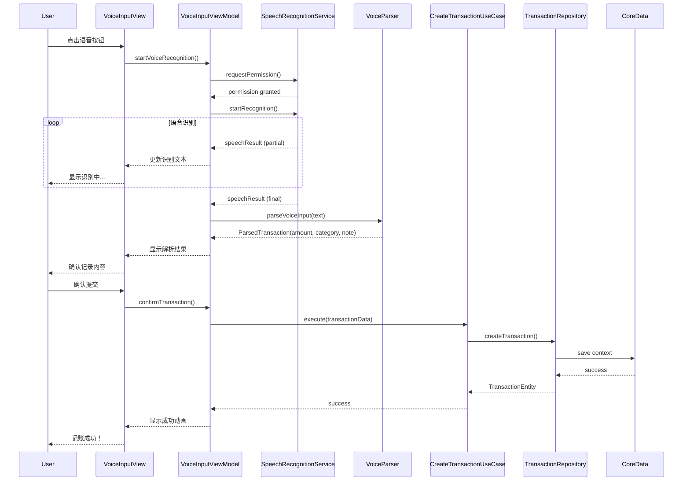
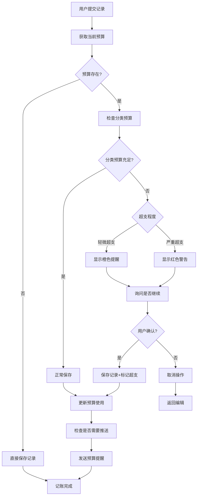
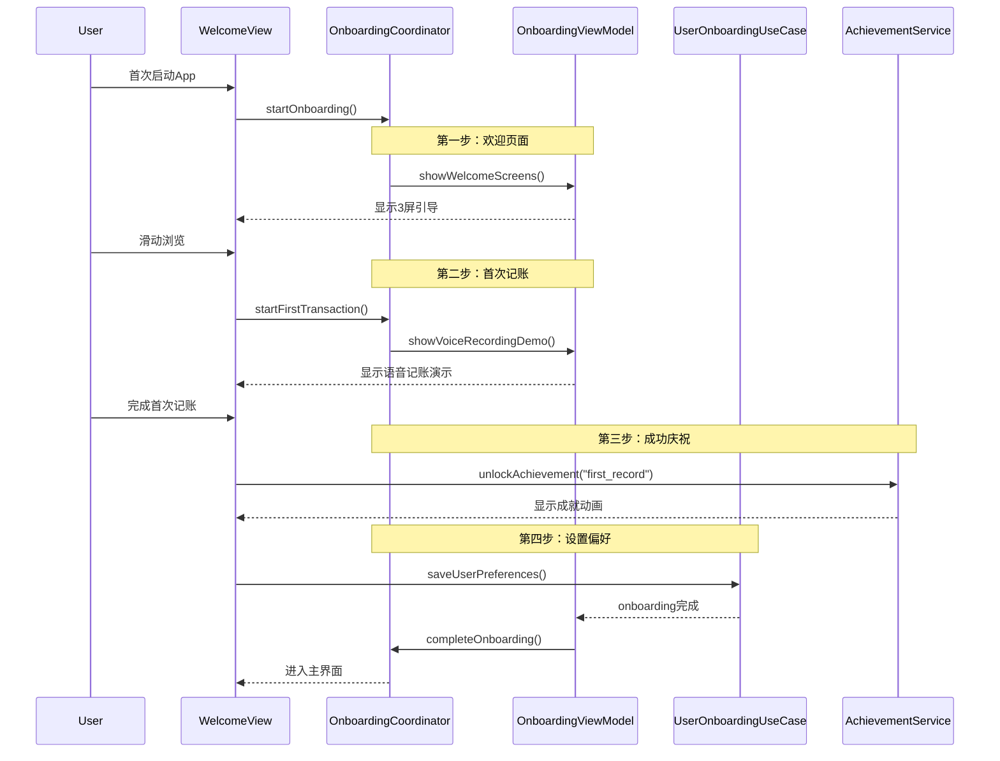

# 架构设计蓝图 (Architecture Blueprint)

## 📋 项目概述

**项目名称**: VoiceBudget - 极简语音记账App  
**技术栈**: iOS 14.0+ | SwiftUI + Combine | Core Data + CloudKit  
**架构模式**: MVVM + Clean Architecture  
**开发语言**: Swift 5.0+  
**最后更新**: 2025年9月11日

---

## 🏗️ 整体架构设计

### 架构分层

```
┌─────────────────────────────────────────────────────────────┐
│                    Presentation Layer                       │
│  ┌─────────────┐ ┌─────────────┐ ┌─────────────────────────┐ │
│  │   SwiftUI   │ │  ViewModels │ │    Coordinators         │ │
│  │    Views    │ │  (ObservableObject) │  (Navigation)   │ │
│  └─────────────┘ └─────────────┘ └─────────────────────────┘ │
└─────────────────────────────────────────────────────────────┘
┌─────────────────────────────────────────────────────────────┐
│                     Domain Layer                            │
│  ┌─────────────┐ ┌─────────────┐ ┌─────────────────────────┐ │
│  │   Entities  │ │ Use Cases   │ │    Repository           │ │
│  │  (Models)   │ │ (Business   │ │    Protocols            │ │
│  │             │ │  Logic)     │ │                         │ │
│  └─────────────┘ └─────────────┘ └─────────────────────────┘ │
└─────────────────────────────────────────────────────────────┘
┌─────────────────────────────────────────────────────────────┐
│                      Data Layer                             │
│  ┌─────────────┐ ┌─────────────┐ ┌─────────────────────────┐ │
│  │  Core Data  │ │   CloudKit  │ │    External APIs        │ │
│  │  Repository │ │   Sync      │ │   (Speech, Photos)      │ │
│  └─────────────┘ └─────────────┘ └─────────────────────────┘ │
└─────────────────────────────────────────────────────────────┘
┌─────────────────────────────────────────────────────────────┐
│                   Infrastructure Layer                      │
│  ┌─────────────┐ ┌─────────────┐ ┌─────────────────────────┐ │
│  │   Network   │ │   Storage   │ │      Services           │ │
│  │   Manager   │ │   Manager   │ │  (Speech, Biometric)    │ │
│  └─────────────┘ └─────────────┘ └─────────────────────────┘ │
└─────────────────────────────────────────────────────────────┘
```

---

## 📊 数据模型设计

### Core Data 实体设计

#### 1. Transaction (记账记录)

```swift
// Transaction.xcdatamodeld DDL equivalent
@Entity
class Transaction: NSManagedObject, Identifiable {
    @NSManaged var id: UUID
    @NSManaged var amount: Decimal           // 金额
    @NSManaged var categoryID: String        // 分类ID
    @NSManaged var categoryName: String      // 分类名称
    @NSManaged var note: String?             // 备注
    @NSManaged var date: Date               // 记录时间
    @NSManaged var createdAt: Date          // 创建时间
    @NSManaged var updatedAt: Date          // 修改时间
    @NSManaged var source: String           // 记录来源: voice, photo, manual, auto
    @NSManaged var isDeleted: Bool          // 软删除标记
    @NSManaged var syncStatus: String      // 同步状态: pending, synced, failed
    
    // 关联关系
    @NSManaged var budget: Budget?
    @NSManaged var modifications: Set<TransactionModification>
}
```

#### 2. Budget (预算)

```swift
@Entity
class Budget: NSManagedObject, Identifiable {
    @NSManaged var id: UUID
    @NSManaged var totalAmount: Decimal     // 总预算
    @NSManaged var period: String          // 周期类型: week, month
    @NSManaged var startDate: Date         // 开始日期
    @NSManaged var endDate: Date          // 结束日期
    @NSManaged var modificationCount: Int16 // 修改次数
    @NSManaged var isActive: Bool          // 是否激活
    @NSManaged var createdAt: Date
    @NSManaged var updatedAt: Date
    
    // 关联关系
    @NSManaged var categories: Set<BudgetCategory>
    @NSManaged var transactions: Set<Transaction>
}
```

#### 3. BudgetCategory (预算分类)

```swift
@Entity
class BudgetCategory: NSManagedObject, Identifiable {
    @NSManaged var id: String              // 分类ID
    @NSManaged var name: String            // 分类名称
    @NSManaged var icon: String            // 图标名称
    @NSManaged var color: String           // 颜色代码
    @NSManaged var allocatedAmount: Decimal // 分配金额
    @NSManaged var isCustom: Bool          // 是否自定义分类
    @NSManaged var displayOrder: Int16     // 显示顺序
    @NSManaged var isUnlocked: Bool        // 是否解锁
    @NSManaged var unlockDate: Date?       // 解锁日期
    
    // 关联关系
    @NSManaged var budget: Budget
    @NSManaged var keywordMappings: Set<CategoryKeyword>
}
```

#### 4. CategoryKeyword (分类关键词映射)

```swift
@Entity
class CategoryKeyword: NSManagedObject {
    @NSManaged var keyword: String         // 关键词
    @NSManaged var confidence: Double      // 匹配置信度
    @NSManaged var frequency: Int16        // 使用频次
    @NSManaged var lastUsed: Date         // 最后使用时间
    
    @NSManaged var category: BudgetCategory
}
```

#### 5. Achievement (成就)

```swift
@Entity
class Achievement: NSManagedObject, Identifiable {
    @NSManaged var id: String             // 成就ID
    @NSManaged var title: String          // 成就标题
    @NSManaged var description: String    // 成就描述
    @NSManaged var iconName: String       // 图标名称
    @NSManaged var isUnlocked: Bool       // 是否解锁
    @NSManaged var unlockedAt: Date?      // 解锁时间
    @NSManaged var type: String          // 成就类型: streak, budget, social, etc
    @NSManaged var progress: Int16        // 进度
    @NSManaged var target: Int16          // 目标值
}
```

#### 6. UserPreference (用户偏好)

```swift
@Entity
class UserPreference: NSManagedObject {
    @NSManaged var key: String            // 配置键
    @NSManaged var value: String          // 配置值
    @NSManaged var type: String          // 值类型: string, bool, int, double
    @NSManaged var updatedAt: Date
}
```

#### 7. TransactionModification (记录修改历史)

```swift
@Entity
class TransactionModification: NSManagedObject {
    @NSManaged var id: UUID
    @NSManaged var fieldName: String      // 修改字段
    @NSManaged var oldValue: String       // 原值
    @NSManaged var newValue: String       // 新值
    @NSManaged var modifiedAt: Date       // 修改时间
    @NSManaged var reason: String         // 修改原因
    
    @NSManaged var transaction: Transaction
}
```

### CloudKit Schema映射

```json
{
  "Transaction": {
    "recordType": "Transaction",
    "fields": {
      "amount": "Double",
      "categoryID": "String",
      "categoryName": "String", 
      "note": "String",
      "date": "DateTime",
      "createdAt": "DateTime",
      "updatedAt": "DateTime",
      "source": "String",
      "isDeleted": "Int64"
    }
  },
  "Budget": {
    "recordType": "Budget",
    "fields": {
      "totalAmount": "Double",
      "period": "String",
      "startDate": "DateTime",
      "endDate": "DateTime",
      "modificationCount": "Int64",
      "isActive": "Int64"
    }
  }
}
```

---

## 🔗 API接口契约

### 内部API设计 (Repository Pattern)

#### TransactionRepository

```swift
protocol TransactionRepository {
    // 创建记录
    func createTransaction(_ transaction: TransactionEntity) async throws -> TransactionEntity
    
    // 查询记录
    func fetchTransactions(
        startDate: Date?,
        endDate: Date?,
        categoryID: String?,
        limit: Int?
    ) async throws -> [TransactionEntity]
    
    // 更新记录
    func updateTransaction(_ transaction: TransactionEntity) async throws -> TransactionEntity
    
    // 软删除记录
    func deleteTransaction(id: UUID) async throws
    
    // 获取统计数据
    func getTransactionSummary(
        startDate: Date,
        endDate: Date
    ) async throws -> TransactionSummary
}
```

#### BudgetRepository

```swift
protocol BudgetRepository {
    // 创建预算
    func createBudget(_ budget: BudgetEntity) async throws -> BudgetEntity
    
    // 获取当前激活预算
    func getCurrentBudget() async throws -> BudgetEntity?
    
    // 更新预算
    func updateBudget(_ budget: BudgetEntity) async throws -> BudgetEntity
    
    // 获取预算使用情况
    func getBudgetUsage(budgetID: UUID) async throws -> BudgetUsage
    
    // 检查是否可修改
    func canModifyBudget(budgetID: UUID) async throws -> Bool
}
```

### 外部API集成

#### 语音识别API

```swift
// Speech Framework 封装
protocol SpeechRecognitionService {
    func requestPermission() async -> Bool
    func startRecognition() async throws -> AsyncStream<SpeechRecognitionResult>
    func stopRecognition()
}

struct SpeechRecognitionResult {
    let text: String
    let confidence: Float
    let isFinal: Bool
    let segments: [SpeechSegment]
}

struct SpeechSegment {
    let text: String
    let startTime: TimeInterval
    let duration: TimeInterval
    let confidence: Float
}
```

#### OCR识别API (Vision Framework)

```swift
protocol OCRService {
    func recognizeText(from image: UIImage) async throws -> OCRResult
    func recognizeReceipt(from image: UIImage) async throws -> ReceiptData
}

struct OCRResult {
    let recognizedText: String
    let confidence: Float
    let boundingBoxes: [TextBoundingBox]
}

struct ReceiptData {
    let merchantName: String?
    let totalAmount: Decimal?
    let date: Date?
    let items: [ReceiptItem]
}
```

---

## 🔄 核心流程图

### 语音记账流程



### 预算检查流程



### FTUX新手引导流程



---

## 🧩 组件交互说明

### 模块依赖关系

```
App
├── Presentation/
│   ├── Views/
│   │   ├── HomeView.swift                    [新建]
│   │   ├── VoiceInputView.swift             [新建]  
│   │   ├── BudgetSetupView.swift            [新建]
│   │   ├── StatisticsView.swift             [新建]
│   │   ├── SettingsView.swift               [新建]
│   │   └── Components/
│   │       ├── CategoryPicker.swift         [新建]
│   │       ├── BudgetProgressView.swift     [新建]
│   │       └── AchievementBadge.swift       [新建]
│   ├── ViewModels/
│   │   ├── HomeViewModel.swift              [新建]
│   │   ├── VoiceInputViewModel.swift        [新建]
│   │   ├── BudgetViewModel.swift            [新建]
│   │   └── StatisticsViewModel.swift        [新建]
│   └── Coordinators/
│       ├── AppCoordinator.swift             [新建]
│       ├── OnboardingCoordinator.swift      [新建]
│       └── MainTabCoordinator.swift         [新建]
├── Domain/
│   ├── Entities/
│   │   ├── TransactionEntity.swift          [新建]
│   │   ├── BudgetEntity.swift               [新建]
│   │   ├── CategoryEntity.swift             [新建]
│   │   └── AchievementEntity.swift          [新建]
│   ├── UseCases/
│   │   ├── CreateTransactionUseCase.swift   [新建]
│   │   ├── GetBudgetStatusUseCase.swift     [新建]
│   │   ├── ProcessVoiceInputUseCase.swift   [新建]
│   │   └── TrackAchievementUseCase.swift    [新建]
│   └── Repositories/
│       ├── TransactionRepository.swift      [新建]
│       ├── BudgetRepository.swift           [新建]
│       └── UserPreferenceRepository.swift   [新建]
├── Data/
│   ├── CoreData/
│   │   ├── VoiceBudgetModel.xcdatamodeld   [新建]
│   │   ├── CoreDataStack.swift              [新建]
│   │   └── Entities/
│   │       ├── Transaction+CoreDataClass.swift [新建]
│   │       └── Budget+CoreDataClass.swift       [新建]
│   ├── Repositories/
│   │   ├── CoreDataTransactionRepository.swift [新建]
│   │   ├── CoreDataBudgetRepository.swift       [新建]
│   │   └── UserDefaultsPreferenceRepository.swift [新建]
│   └── CloudKit/
│       ├── CloudKitSyncManager.swift        [新建]
│       └── CloudKitRepository.swift         [新建]
├── Infrastructure/
│   ├── Services/
│   │   ├── SpeechRecognitionService.swift   [新建]
│   │   ├── OCRService.swift                 [新建]
│   │   ├── BiometricService.swift           [新建]
│   │   ├── NotificationService.swift        [新建]
│   │   └── HapticFeedbackService.swift      [新建]
│   ├── Utils/
│   │   ├── VoiceParser.swift                [新建]
│   │   ├── CategoryMatcher.swift            [新建]
│   │   ├── DateHelper.swift                 [新建]
│   │   └── CurrencyFormatter.swift          [新建]
│   └── Extensions/
│       ├── Date+Extensions.swift            [新建]
│       ├── Decimal+Extensions.swift         [新建]
│       └── String+Extensions.swift          [新建]
└── Resources/
    ├── Assets.xcassets/                     [新建]
    ├── Localizable.strings                  [新建]
    └── Info.plist                           [修改]
```

### 核心组件交互

#### 1. 语音记账交互链

```
VoiceInputView -> VoiceInputViewModel -> ProcessVoiceInputUseCase -> VoiceParser -> CategoryMatcher -> CreateTransactionUseCase -> TransactionRepository
```

#### 2. 预算检查交互链

```
CreateTransactionUseCase -> GetBudgetStatusUseCase -> BudgetRepository -> BudgetUsageCalculator -> NotificationService
```

#### 3. 数据同步交互链

```
CoreDataRepository -> CloudKitSyncManager -> CloudKitRepository -> iCloud
```

### 新增文件与现有文件关系

**当前项目状态**: 全新项目，所有文件都需要新建

**关键依赖关系**:
1. **App.swift** [新建] - 应用入口，依赖 AppCoordinator
2. **VoiceBudgetModel.xcdatamodeld** [新建] - Core Data 模型，被所有 Repository 依赖
3. **CoreDataStack.swift** [新建] - 数据栈，被所有 Core Data Repository 依赖
4. **AppCoordinator.swift** [新建] - 主协调器，管理所有页面导航

---

## ⚙️ 技术选型与风险

### 核心技术选型

#### 1. UI框架: SwiftUI + Combine

**选择理由**:
- iOS 14.0+ 原生支持
- 声明式UI，代码简洁
- 与 Combine 完美集成
- 支持 Widget 开发

**潜在风险**:
- SwiftUI 某些复杂动画可能需要 UIKit 补充
- 调试工具相对不够成熟

**风险缓解**:
- 为复杂组件预留 UIViewRepresentable 包装方案
- 采用渐进式开发，及时发现问题

#### 2. 数据存储: Core Data + CloudKit

**选择理由**:
- Core Data 提供强大的本地数据管理
- CloudKit 无缝 iCloud 同步
- 原生支持，无额外成本

**潜在风险**:
- CloudKit 同步冲突处理复杂
- Core Data 迁移可能出现问题

**风险缓解**:
```swift
// 同步冲突处理策略
enum SyncConflictResolution {
    case clientWins      // 客户端优先
    case serverWins      // 服务端优先  
    case mergeChanges    // 智能合并
    case promptUser      // 提示用户选择
}
```

#### 3. 语音识别: Speech Framework

**选择理由**:
- 系统原生，准确率高
- 支持实时识别
- 隐私保护好

**潜在风险**:
- 网络依赖（在线识别）
- 方言支持有限
- 识别准确率受环境影响

**风险缓解**:
```swift
// 语音识别降级策略
class SpeechFallbackStrategy {
    func handleRecognitionFailure() {
        // 1. 重试机制
        // 2. 手动输入引导
        // 3. 常用记录快捷选择
        // 4. 离线关键词匹配
    }
}
```

#### 4. 架构模式: MVVM + Clean Architecture

**选择理由**:
- 职责分离清晰
- 便于测试
- 易于维护和扩展

**潜在风险**:
- 初期开发成本较高
- 过度抽象可能增加复杂性

**风险缓解**:
- 采用渐进式重构
- 重要业务逻辑优先抽象

### 关键技术实现

#### 1. 语音解析算法

```swift
class VoiceParser {
    private let amountPatterns: [NSRegularExpression]
    private let categoryKeywords: [String: CategoryEntity]
    private let temporalPatterns: [NSRegularExpression]
    
    func parse(_ text: String) -> ParsedTransaction {
        let amount = extractAmount(from: text)
        let category = matchCategory(from: text) 
        let date = extractDate(from: text)
        let note = extractNote(from: text, excluding: [amount, category, date])
        
        return ParsedTransaction(
            amount: amount,
            category: category,
            date: date,
            note: note,
            confidence: calculateConfidence()
        )
    }
}
```

#### 2. 智能分类匹配

```swift
class CategoryMatcher {
    private let mlModel: CategoryClassificationModel
    private let keywordMatcher: KeywordMatcher
    
    func matchCategory(_ text: String, userHistory: [Transaction]) -> CategoryMatch {
        // 1. ML模型预测
        let mlPrediction = mlModel.predict(text)
        
        // 2. 关键词匹配
        let keywordMatch = keywordMatcher.match(text)
        
        // 3. 用户历史偏好
        let userPreference = analyzeUserPattern(text, userHistory)
        
        // 4. 加权融合
        return combineResults([mlPrediction, keywordMatch, userPreference])
    }
}
```

#### 3. 预算预警系统

```swift
class BudgetAlertSystem {
    func checkBudgetStatus(_ transaction: TransactionEntity) async -> BudgetAlert? {
        let budget = await getBudgetForTransaction(transaction)
        let usage = await calculateBudgetUsage(budget, including: transaction)
        
        switch usage.percentage {
        case 0.8...0.99:
            return .warning(message: "预算即将用完", level: .medium)
        case 1.0...:
            return .exceeded(message: "预算已超支", level: .high)
        default:
            return nil
        }
    }
}
```

### 性能优化策略

#### 1. 数据加载优化

```swift
// 分页加载策略
class TransactionPaginator {
    private let pageSize = 50
    private var currentPage = 0
    
    func loadNextPage() async -> [TransactionEntity] {
        // 实现分页加载逻辑
        let startIndex = currentPage * pageSize
        return await repository.fetchTransactions(
            offset: startIndex,
            limit: pageSize
        )
    }
}
```

#### 2. 内存管理

```swift
// 图片缓存策略
class ReceiptImageCache {
    private let cache = NSCache<NSString, UIImage>()
    private let maxMemoryUsage: Int = 50 * 1024 * 1024 // 50MB
    
    init() {
        cache.totalCostLimit = maxMemoryUsage
        setupMemoryWarningObserver()
    }
}
```

### 安全考虑

#### 1. 数据加密

```swift
// Core Data 加密配置
class SecureDataStack {
    private func setupPersistentContainer() -> NSPersistentContainer {
        let container = NSPersistentCloudKitContainer(name: "VoiceBudgetModel")
        
        // 启用数据加密
        let storeDescription = container.persistentStoreDescriptions.first
        storeDescription?.setOption(
            FileProtectionType.completeUntilFirstUserAuthentication,
            forKey: NSPersistentStoreFileProtectionKey
        )
        
        return container
    }
}
```

#### 2. 生物识别验证

```swift
class BiometricService {
    func authenticateUser() async throws -> Bool {
        let context = LAContext()
        
        guard context.canEvaluatePolicy(.deviceOwnerAuthenticationWithBiometrics, error: nil) else {
            throw BiometricError.notAvailable
        }
        
        return try await context.evaluatePolicy(
            .deviceOwnerAuthenticationWithBiometrics,
            localizedReason: "验证身份以访问财务数据"
        )
    }
}
```

---

## 🚀 实施计划

### 开发优先级

**Phase 1: 核心功能** (Week 1-2)
1. Core Data 模型设计和实现
2. 基础 Repository 层
3. 语音记账基础功能
4. 简单的分类系统

**Phase 2: 用户体验** (Week 3-4)  
1. FTUX 新手引导
2. 预算管理系统
3. 统计页面
4. 设置页面

**Phase 3: 高级功能** (Week 5-6)
1. CloudKit 同步
2. Widget 小组件
3. 成就系统
4. 社交分享

**Phase 4: 优化和测试** (Week 7-8)
1. 性能优化
2. 错误处理完善
3. 单元测试和集成测试
4. UI/UX 细节打磨

### 关键里程碑

- **Week 2**: 基础记账功能可用
- **Week 4**: 完整功能演示版本
- **Week 6**: Beta 测试版本
- **Week 8**: 正式发布版本

### 风险应对预案

1. **语音识别准确率不达标**
   - 增加手动纠错功能
   - 优化关键词匹配算法
   - 提供快捷输入方式

2. **CloudKit 同步问题**
   - 实现本地数据备份
   - 添加手动同步选项
   - 提供数据导出功能

3. **性能问题**
   - 实现数据分页加载
   - 优化图片和动画
   - 添加性能监控

---

## 📋 总结

本架构蓝图提供了 VoiceBudget 应用的完整技术实现方案，包括：

✅ **完整的数据模型设计** - Core Data + CloudKit 双层存储  
✅ **清晰的架构分层** - MVVM + Clean Architecture  
✅ **详细的API契约** - Repository 模式 + Protocol 定义  
✅ **核心业务流程** - 语音记账 + 预算管理 + 用户引导  
✅ **技术风险评估** - 识别风险点并提供缓解方案  
✅ **实施路径规划** - 8周开发计划，分4个阶段执行  

这份蓝图可以直接指导自动化开发系统进行代码生成，确保项目的技术可行性和可维护性。