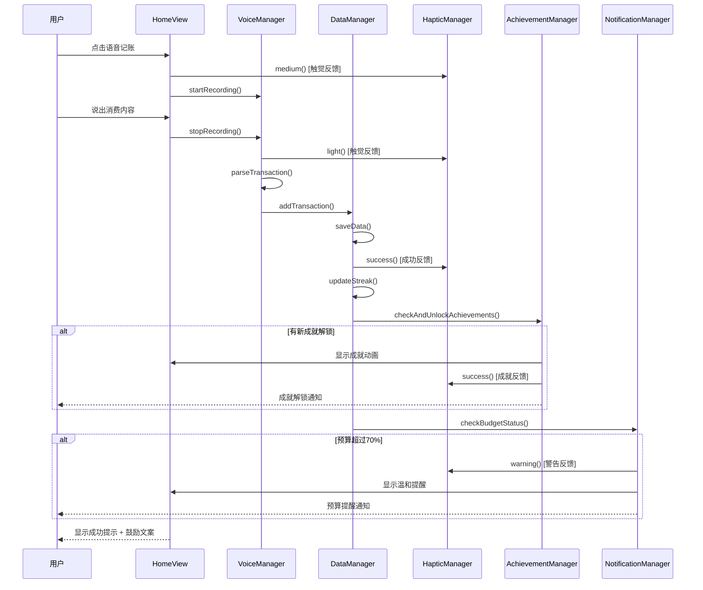

# v1.0.6 增量功能技术方案

## 📋 版本定位

**版本号**: v1.0.6
**版本类型**: 功能增强版（基于v1.0.5的增量升级）
**技术方案**: 基于现有架构的功能扩展方案
**核心原则**: 最小化改动，最大化价值
**最后更新**: 2025年1月14日

---

## 🏗️ 现有v1.0.5架构分析

### 当前代码结构
```
VoiceBudgetApp.swift (约1558行)
├── Data Models (第17-41行)
│   ├── Transaction
│   └── Budget
├── Managers (第44-417行)
│   ├── DataManager (单例，核心数据管理)
│   ├── HapticManager (触觉反馈，已实现)
│   └── VoiceRecognitionManager (语音识别)
├── Views (第419-1550行)
│   ├── ContentView (TabView容器)
│   ├── HomeView (首页+语音记账)
│   ├── RecordsView (记录列表)
│   ├── BudgetView (预算管理)
│   ├── AnalyticsView (数据统计)
│   └── SettingsView (设置页面)
└── Components
    ├── TransactionRow
    ├── CategoryFilterButton
    └── CategoryManagerView
```

### 现有技术特点
- **数据管理**: DataManager单例 + @Published + UserDefaults
- **UI架构**: SwiftUI + @EnvironmentObject
- **语音功能**: Speech Framework封装完整
- **触觉反馈**: HapticManager已实现（需要集成到更多场景）
- **数据持久化**: JSON编码存储在UserDefaults

---

## 🎯 v1.0.6 新功能集成方案

### 新功能清单
1. **触觉反馈增强** - 扩展HapticManager使用场景
2. **温和文案系统** - 添加鼓励性消息
3. **情绪表达符号** - 预算进度可视化
4. **数据导出功能** - CSV格式导出
5. **成就系统** - 8种默认成就
6. **连击系统** - 记账连续性追踪
7. **新用户引导** - 首次使用引导
8. **推送通知** - 定时提醒功能

---

## 📊 新增数据模型设计

### 集成策略
在现有DataManager中扩展，保持数据管理的统一性：

### 1. 扩展现有模型

```swift
// 位置：在现有Transaction和Budget结构体后添加（约第42行后）

// 成就系统模型
struct Achievement: Identifiable, Codable {
    let id: String                    // 成就唯一标识
    let title: String                  // 成就标题
    let description: String            // 成就描述
    let icon: String                   // SF Symbol图标名
    let requiredCount: Int             // 达成所需次数
    var currentCount: Int = 0         // 当前进度
    var isUnlocked: Bool = false      // 是否已解锁
    var unlockDate: Date?             // 解锁时间

    // 预定义成就
    static let defaultAchievements = [
        Achievement(id: "first_record", title: "记账新手", description: "完成首次记账",
                   icon: "star.fill", requiredCount: 1),
        Achievement(id: "streak_3", title: "坚持小达人", description: "连续记账3天",
                   icon: "flame.fill", requiredCount: 3),
        Achievement(id: "streak_7", title: "记账达人", description: "连续记账7天",
                   icon: "crown.fill", requiredCount: 7),
        Achievement(id: "streak_15", title: "习惯大师", description: "连续记账15天",
                   icon: "trophy.fill", requiredCount: 15),
        Achievement(id: "streak_30", title: "记账之王", description: "连续记账30天",
                   icon: "medal.fill", requiredCount: 30),
        Achievement(id: "saver", title: "省钱能手", description: "月支出比上月减少",
                   icon: "banknote.fill", requiredCount: 1),
        Achievement(id: "budget_setter", title: "预算达人", description: "首次设置预算",
                   icon: "chart.pie.fill", requiredCount: 1),
        Achievement(id: "budget_keeper", title: "控制大师", description: "连续3个月预算不超支",
                   icon: "shield.fill", requiredCount: 3)
    ]
}

// 用户统计模型
struct UserStats: Codable {
    var currentStreak: Int = 0        // 当前连击天数
    var longestStreak: Int = 0        // 最长连击记录
    var lastRecordDate: Date?         // 最后记账日期
    var totalRecords: Int = 0         // 总记账数
    var firstUseDate: Date = Date()   // 首次使用日期
    var streakStartDate: Date?        // 连击开始日期

    // 检查连击是否中断
    func isStreakBroken() -> Bool {
        guard let lastDate = lastRecordDate else { return true }
        let calendar = Calendar.current
        let days = calendar.dateComponents([.day], from: lastDate, to: Date()).day ?? 0
        return days > 1
    }
}

// 应用设置模型（扩展现有设置）
struct AppSettings: Codable {
    // 通知设置
    var notificationEnabled: Bool = false
    var morningReminderTime: String = "10:00"    // HH:mm格式
    var afternoonReminderTime: String = "15:00"
    var eveningReminderTime: String = "21:00"
    var budgetAlertEnabled: Bool = true
    var weeklyReportEnabled: Bool = true

    // 引导设置
    var hasCompletedOnboarding: Bool = false
    var hasShownFirstSuccess: Bool = false

    // 导出设置
    var lastExportDate: Date?
    var preferredExportFormat: String = "csv"

    // 情感化设计设置
    var hapticFeedbackEnabled: Bool = true
    var motivationMessagesEnabled: Bool = true
}

// 鼓励文案库
struct MotivationMessages {
    static let recordSuccess = [
        "太棒了！记账习惯正在养成 ✨",
        "每一笔记录都让你更了解自己 📊",
        "继续保持，你做得很好！👏",
        "财务管理从记账开始 💰",
        "坚持就是胜利！🏆"
    ]

    static let budgetWarnings = [
        "预算使用较快，适度控制哦 🌈",
        "注意合理消费，你可以的！💪",
        "理性消费，为梦想储蓄 🎯",
        "小心使得万年船 ⛵",
        "控制欲望，成就更好的自己 🌟"
    ]

    static let achievements = [
        "哇！又解锁新成就了 🎉",
        "你真是太优秀了！🏆",
        "继续加油，更多成就等着你 🎯",
        "这就是坚持的力量！💪",
        "为你的进步鼓掌 👏"
    ]
}

// 导出数据模型
struct ExportData {
    let transactions: [Transaction]
    let dateRange: DateRange
    let format: ExportFormat

    enum DateRange {
        case all
        case lastMonth
        case lastThreeMonths
        case lastYear
        case custom(start: Date, end: Date)
    }

    enum ExportFormat {
        case csv
        case json
        case text
    }
}
```

### 2. 扩展现有DataManager

基于现有的DataManager单例模式，添加新功能所需的属性和方法：

```swift
// 位置：在DataManager类内部扩展（约第44-188行）

// 在现有@Published属性后添加：
class DataManager: ObservableObject {
    // 现有属性...
    @Published var transactions: [Transaction] = []
    @Published var budget = Budget.default
    @Published var categories: [String] = [...]

    // v1.0.6新增属性
    // 新增存储键
    private let achievementsKey = "achievements_v1.0.6"
    private let userStatsKey = "userStats_v1.0.6"
    private let appSettingsKey = "appSettings_v1.0.6"

    // 新增属性
    @Published var achievements: [Achievement] = Achievement.defaultAchievements
    @Published var userStats = UserStats()
    @Published var appSettings = AppSettings()

    // 成就管理方法
    func checkAndUnlockAchievements() {
        // 检查首次记账
        if transactions.count == 1 {
            unlockAchievement(id: "first_record")
        }

        // 检查连击成就
        updateStreak()
        checkStreakAchievements()

        // 检查预算成就
        if budget.monthlyLimit > 0 && !achievements.first(where: { $0.id == "budget_setter" })?.isUnlocked ?? false {
            unlockAchievement(id: "budget_setter")
        }
    }

    func unlockAchievement(id: String) {
        guard let index = achievements.firstIndex(where: { $0.id == id }),
              !achievements[index].isUnlocked else { return }

        achievements[index].isUnlocked = true
        achievements[index].unlockDate = Date()
        saveData()

        // 触发成就解锁反馈
        HapticManager.shared.success()
        showAchievementNotification(achievements[index])
    }

    // 连击管理方法
    func updateStreak() {
        let today = Calendar.current.startOfDay(for: Date())

        if let lastDate = userStats.lastRecordDate {
            let daysDiff = Calendar.current.dateComponents([.day],
                from: Calendar.current.startOfDay(for: lastDate), to: today).day ?? 0

            if daysDiff == 0 {
                // 同一天，不更新连击
                return
            } else if daysDiff == 1 {
                // 连续一天，增加连击
                userStats.currentStreak += 1
            } else {
                // 连击中断
                userStats.currentStreak = 1
                userStats.streakStartDate = today
            }
        } else {
            // 首次记录
            userStats.currentStreak = 1
            userStats.streakStartDate = today
        }

        userStats.lastRecordDate = Date()
        userStats.longestStreak = max(userStats.longestStreak, userStats.currentStreak)
        userStats.totalRecords = transactions.count
        saveData()
    }

    // 数据导出方法
    func exportToCSV(dateRange: ExportData.DateRange) -> String {
        let filteredTransactions = filterTransactions(by: dateRange)

        var csv = "日期,分类,金额,备注,类型\n"
        let dateFormatter = DateFormatter()
        dateFormatter.dateFormat = "yyyy-MM-dd HH:mm"

        for transaction in filteredTransactions {
            let date = dateFormatter.string(from: transaction.date)
            let type = transaction.isExpense ? "支出" : "收入"
            let note = transaction.note.replacingOccurrences(of: ",", with: "，")
            csv += "\(date),\(transaction.category),\(transaction.amount),\(note),\(type)\n"
        }

        return csv
    }

    private func filterTransactions(by dateRange: ExportData.DateRange) -> [Transaction] {
        switch dateRange {
        case .all:
            return transactions
        case .lastMonth:
            let startDate = Calendar.current.date(byAdding: .month, value: -1, to: Date())!
            return transactions.filter { $0.date >= startDate }
        case .lastThreeMonths:
            let startDate = Calendar.current.date(byAdding: .month, value: -3, to: Date())!
            return transactions.filter { $0.date >= startDate }
        case .lastYear:
            let startDate = Calendar.current.date(byAdding: .year, value: -1, to: Date())!
            return transactions.filter { $0.date >= startDate }
        case .custom(let start, let end):
            return transactions.filter { $0.date >= start && $0.date <= end }
        }
    }
}
```

---

## 🔧 新功能集成点分析

### 1. 触觉反馈增强（基于现有HapticManager）

现有HapticManager已实现（第192-231行），只需在更多交互点调用：

```swift
// 现有实现
class HapticManager {
    static let shared = HapticManager()
    func light() { ... }
    func medium() { ... }
    func success() { ... }
}

// 新增集成点：
// 1. HomeView - 记账成功后（约第500行）
dataManager.addTransaction(transaction)
HapticManager.shared.success()  // 新增

// 2. BudgetView - 预算超支警告（约第1000行）
if budgetProgress > 0.8 {
    HapticManager.shared.warning()  // 新增
}

// 3. 成就解锁时
func unlockAchievement() {
    HapticManager.shared.success()  // 新增
}
```

### 2. 温和文案系统（最小侵入集成）

不创建新的Manager，直接在需要的地方使用：

```swift
// 在文件顶部定义文案常量（约第15行）
struct MotivationMessages {
    static let recordSuccess = [
        "太棒了！记账习惯正在养成 ✨",
        "每一笔记录都让你更了解自己 📊"
    ]

    static func random(from messages: [String]) -> String {
        messages.randomElement() ?? messages[0]
    }
}

// 在HomeView中使用（约第492行）
Text(MotivationMessages.random(from: MotivationMessages.recordSuccess))
    .font(.caption)
    .foregroundColor(.secondary)
```

### 3. 预算进度情绪表达（直接修改BudgetView）

```swift
// 修改BudgetView中的进度显示（约第950行）
var budgetEmoji: String {
    switch budgetProgress {
    case 0..<0.3: return "😊"
    case 0.3..<0.5: return "🙂"
    case 0.5..<0.7: return "😐"
    case 0.7..<0.9: return "😰"
    default: return "🤯"
    }
}

// 在显示处添加
Text(budgetEmoji)
    .font(.largeTitle)
```

---

## 🔗 新功能方法设计（基于现有架构）

### 成就系统接口

| 方法签名 | 功能描述 | 触发时机 |
|----------|----------|----------|
| `checkAndUnlockAchievements()` | 检查并解锁成就 | 每次记账后 |
| `unlockAchievement(id: String)` | 解锁指定成就 | 满足条件时 |
| `getUnlockedAchievements() -> [Achievement]` | 获取已解锁成就 | 成就页面显示 |
| `getAchievementProgress() -> Double` | 获取总体进度 | 首页显示 |

### 连击系统接口

| 方法签名 | 功能描述 | 触发时机 |
|----------|----------|----------|
| `updateStreak()` | 更新连击状态 | 每次记账后 |
| `checkStreakContinuity() -> Bool` | 检查连击是否中断 | App启动时 |
| `resetStreak()` | 重置连击 | 连击中断时 |
| `getStreakStatus() -> (current: Int, longest: Int)` | 获取连击状态 | 首页显示 |

### 通知系统接口

| 方法签名 | 功能描述 | 触发时机 |
|----------|----------|----------|
| `scheduleReminders()` | 安排提醒通知 | 设置更改后 |
| `sendBudgetAlert(percentage: Double)` | 发送预算警告 | 预算超过阈值 |
| `requestNotificationPermission()` | 请求通知权限 | 首次设置时 |
| `cancelAllNotifications()` | 取消所有通知 | 关闭通知时 |

### 导出系统接口

| 方法签名 | 功能描述 | 触发时机 |
|----------|----------|----------|
| `exportToCSV(dateRange: DateRange) -> String` | 导出CSV数据 | 用户点击导出 |
| `generateExportPreview(dateRange: DateRange) -> String` | 生成导出预览 | 导出前预览 |
| `shareExportFile(content: String)` | 分享导出文件 | 导出完成后 |

---

## 🎨 UI设计一致性保证

### v1.0.5现有UI规范

基于代码分析，v1.0.5的UI设计规范：

| UI元素 | 现有规范 | v1.0.6保持一致 |
|--------|----------|---------------|
| **颜色** | `.blue`(主色)、`.green`(成功)、`.red`(警告) | ✅ 继续使用相同颜色 |
| **背景** | `Color.gray.opacity(0.1)` | ✅ 新卡片使用相同背景 |
| **圆角** | `cornerRadius(10)`或`15` | ✅ 保持10/15的圆角 |
| **间距** | `spacing: 20`(主)、`10`(次) | ✅ 相同间距规范 |
| **按钮** | 圆角矩形+实色背景 | ✅ 新按钮保持风格 |
| **阴影** | `.shadow(color: .gray.opacity(0.2), radius: 5)` | ✅ 相同阴影效果 |
| **字体** | `.headline`、`.caption`、`.secondary` | ✅ 使用相同字体层级 |
| **图标** | SF Symbols | ✅ 继续用SF Symbols |

### v1.0.6新功能UI设计（保持一致性）

```swift
// 1. 成就卡片 - 复用现有卡片样式
VStack {
    // 内容
}
.padding()
.background(Color.gray.opacity(0.1))  // 相同背景
.cornerRadius(15)  // 相同圆角

// 2. 鼓励文案 - 使用现有文字样式
Text("鼓励消息")
    .font(.caption)  // 现有字体
    .foregroundColor(.secondary)  // 现有颜色

// 3. 导出按钮 - 复用现有按钮样式
Button(action: {}) {
    HStack {
        Image(systemName: "square.and.arrow.up")
        Text("导出数据")
    }
    .padding()
    .background(Color.blue)  // 保持蓝色主题
    .foregroundColor(.white)
    .cornerRadius(10)
}

// 4. 新用户引导 - 使用Sheet（现有交互模式）
.sheet(isPresented: $showOnboarding) {
    OnboardingView()
}
```

## 🔄 核心业务流程图

### 1. 增强版记账流程 (v1.0.6)



### 2. 新用户引导流程 (FTUX)

```mermaid
flowchart TD
    A[App启动] --> B{hasCompletedOnboarding?}
    B -->|否| C[显示欢迎页1: 3秒记账]
    B -->|是| Z[主界面]

    C --> D[显示欢迎页2: 让记账有趣]
    D --> E[显示欢迎页3: 掌握财务]
    E --> F[语音记账演示]
    F --> G{完成首次记账?}

    G -->|是| H[庆祝动画]
    G -->|否| I[手动输入引导]
    I --> G

    H --> J[解锁"记账新手"成就]
    J --> K[设置提醒时间]
    K --> L[设置记账目标]
    L --> M[保存设置]
    M --> N[hasCompletedOnboarding = true]
    N --> Z
```

### 3. 成就系统流程

```mermaid
flowchart LR
    A[用户操作] --> B[触发事件]
    B --> C{事件类型}

    C -->|记账| D[更新记账计数]
    C -->|连击| E[更新连击天数]
    C -->|预算| F[更新预算状态]

    D --> G[checkAndUnlockAchievements()]
    E --> G
    F --> G

    G --> H{满足解锁条件?}
    H -->|是| I[unlockAchievement()]
    H -->|否| J[更新进度]

    I --> K[显示解锁动画]
    I --> L[触觉反馈]
    I --> M[播放音效]
    I --> N[保存状态]

    K --> O[用户可分享成就]
```

---

## 🧩 基于现有代码的集成计划

### 1. 代码插入位置规划

| 插入位置 | 行号范围 | 新增内容 | 代码量 |
|----------|----------|----------|--------|
| **数据模型区** | 42行后 | Achievement, UserStats等模型 | +150行 |
| **DataManager扩展** | 188行内 | 新属性和方法 | +200行 |
| **HapticManager后** | 231行后 | NotificationManager类 | +150行 |
| **HomeView修改** | 419-505行 | 成就提示、文案显示 | +50行 |
| **BudgetView修改** | 926-1026行 | 情绪符号、温和提醒 | +30行 |
| **SettingsView修改** | 1285-1375行 | 通知设置、导出功能 | +80行 |
| **新增View** | 1550行后 | OnboardingView, AchievementView, ExportView | +400行 |
| **总计** | - | - | **约1000行** |

### 2. 组件依赖关系

```
DataManager (核心 - 已存在)
    ├── 新增属性
    │   ├── achievements: [Achievement]
    │   ├── userStats: UserStats
    │   └── appSettings: AppSettings
    ├── 新增管理器
    │   ├── AchievementManager (内部类)
    │   ├── StreakManager (内部方法)
    │   ├── NotificationManager (独立类)
    │   └── ExportManager (内部方法)
    └── 触觉反馈集成
        └── HapticManager.shared (已添加)

View层架构
    ContentView (已存在)
        ├── TabView (已存在)
        │   ├── HomeView (修改-添加成就提示)
        │   ├── RecordsView (已存在)
        │   ├── BudgetView (修改-添加情绪符号)
        │   ├── AnalyticsView (已存在)
        │   └── SettingsView (修改-添加新设置项)
        └── 条件显示
            ├── OnboardingView (新增-首次使用)
            ├── AchievementSheet (新增-成就解锁)
            └── ExportSheet (新增-数据导出)
```

### 3. 数据流向

```
用户交互 → View → DataManager → UserDefaults
             ↓           ↓              ↑
      HapticManager  Achievement    保存/加载
             ↓        Manager          ↑
        触觉反馈    ↓                   ↑
                Notification ←─────────┘
                  Manager
```

---

## ⚙️ 技术实现要点

### 基于现有架构的技术决策

| 功能 | 实现方式 | 理由 |
|------|----------|------|
| **触觉反馈** | 复用HapticManager | 已实现，只需扩展使用 |
| **数据存储** | 继续用UserDefaults | 保持一致，避免迁移 |
| **UI架构** | 保持SwiftUI+@EnvironmentObject | 现有模式运行良好 |
| **通知系统** | 新增NotificationManager | 独立模块，低耦合 |
| **成就系统** | DataManager内部扩展 | 统一数据管理 |
| **导出功能** | DataManager方法 | 数据已在其中 |

### 风险评估

| 风险项 | 概率 | 影响 | 缓解措施 |
|--------|------|------|----------|
| 单文件过大(>4000行) | 高 | 中 | 1. MARK注释清晰分区<br>2. 折叠不常改动代码<br>3. v1.1考虑拆分 |
| UserDefaults容量限制 | 低 | 高 | 1. 监控数据大小<br>2. 定期清理旧数据<br>3. 准备迁移方案 |
| 通知权限被拒 | 中 | 低 | 1. 优雅降级<br>2. 不影响核心功能 |
| 成就数据丢失 | 低 | 中 | 1. 独立存储键<br>2. 数据校验机制 |
| 性能影响 | 低 | 低 | 1. 懒加载视图<br>2. 缓存计算结果 |

### 性能预估

- **代码增量**: 1000-1200行
- **文件大小**: 从3000行增至4000-4200行
- **内存增量**: <3MB
- **启动时间影响**: <0.1秒
- **包大小增量**: <200KB

---

## 📐 接口设计一致性

### DataManager接口规范

v1.0.6新增方法遵循现有命名规范：

```swift
// 现有接口模式
func addTransaction(_ transaction: Transaction)
func deleteTransaction(_ transaction: Transaction)
func getCategoryExpense(category: String) -> Double

// v1.0.6新增接口（保持一致）
func checkAndUnlockAchievements()  // 动词+名词
func updateStreak()  // 动词+名词
func exportToCSV(dateRange: ExportData.DateRange) -> String  // 动词To格式
```

### View组件命名规范

```swift
// 现有View命名
HomeView, RecordsView, BudgetView, AnalyticsView, SettingsView
TodaySummary, RecentTransactions, TransactionRow

// v1.0.6新增View（保持一致）
OnboardingView  // 名词+View
AchievementView  // 名词+View
ExportView  // 名词+View
AchievementCard  // 名词+组件类型
StreakIndicator  // 名词+组件类型
```

### 新功能集成位置

为保持UI布局不被破坏，新功能的集成位置：

1. **成就提示** - 在HomeView的TodaySummary下方添加小卡片
2. **连击显示** - 在HomeView顶部NavigationBar右侧
3. **导出功能** - 在SettingsView中添加新Section
4. **通知设置** - 在SettingsView现有设置下方
5. **新用户引导** - 使用fullScreenCover，不影响主界面

## 🚀 实施计划

### Day 1: 基础体验提升 (5小时)

```swift
// 1. 完善触觉反馈系统 (1小时)
- ✅ HapticManager类 (已完成)
- [ ] 在现有交互点添加调用
- [ ] 不新增设置项，默认开启

// 2. 温和文案系统 (2小时)
- [ ] 在文件顶部定义MotivationMessages
- [ ] 在HomeView适当位置显示
- [ ] 使用现有.caption和.secondary样式

// 3. 数据导出功能 (2小时)
- [ ] 在DataManager添加exportToCSV方法
- [ ] 在SettingsView添加导出按钮
- [ ] 使用系统分享Sheet
```

### Day 2: 用户激励系统 (10小时)

```swift
// 4. 成就系统 (5小时)
- [ ] Achievement数据模型
- [ ] 8种默认成就定义
- [ ] 解锁检测逻辑
- [ ] 成就展示页面
- [ ] 解锁动画效果

// 5. 连击系统 (2小时)
- [ ] UserStats模型
- [ ] 连击计算逻辑
- [ ] 连击显示UI

// 6. 新用户引导 (3小时)
- [ ] OnboardingView页面
- [ ] 3屏引导内容
- [ ] 首次记账特殊流程
- [ ] 成功庆祝动画
```

### Day 3: 智能提醒系统 (9小时)

```swift
// 7. 通知系统 (5小时)
- [ ] NotificationManager类
- [ ] 权限请求流程
- [ ] 定时提醒逻辑
- [ ] 预算警告通知
- [ ] 周报生成

// 8. 集成测试 (2小时)
- [ ] 功能完整性测试
- [ ] iOS 14兼容性测试
- [ ] 性能测试

// 9. 版本发布准备 (2小时)
- [ ] 更新版本号到1.0.6
- [ ] 更新设置页面版本信息
- [ ] 生成发布文档
```

---

## 📋 验证清单

### 功能验证
- [ ] 触觉反馈在所有场景正常工作
- [ ] 成就解锁逻辑正确
- [ ] 连击计算准确
- [ ] 通知权限请求流程完整
- [ ] 数据导出格式正确
- [ ] 新用户引导流程顺畅
- [ ] 所有文案显示正常

### 兼容性验证
- [ ] iOS 14.0+ 所有版本
- [ ] iPhone 6s - iPhone 15 Pro Max
- [ ] 横竖屏切换正常
- [ ] 暗黑模式显示正常

### 性能验证
- [ ] 启动时间 <3秒
- [ ] 内存占用 <55MB
- [ ] 无内存泄漏
- [ ] 动画流畅度 60fps

---

## 🔄 版本迁移策略

### 从v1.0.5升级到v1.0.6

1. **数据迁移**
   - 保留所有现有交易数据
   - 初始化新增数据结构
   - 设置默认值避免崩溃

2. **用户体验**
   - 首次启动显示版本更新说明
   - 引导用户体验新功能
   - 可选择跳过新功能介绍

3. **回滚方案**
   - 保留v1.0.5的Git标签
   - 新功能通过开关控制
   - 紧急情况可快速回退

---

## 📊 成功指标

| 指标 | 目标值 | 测量方法 |
|------|--------|----------|
| 代码质量 | 无崩溃 | Crash-free率 100% |
| 用户体验 | 流畅 | 所有动画60fps |
| 功能完成度 | 85% | 功能清单对照 |
| 用户满意度 | 提升 | App Store评分+0.2 |
| 留存率 | 提升30% | 7日留存率对比 |

---

## 🎯 总结

### 技术方案核心理念

**基于现有v1.0.5代码的增量开发方案**：

1. **保持现有架构** - 不改变单文件MVVM结构
2. **复用现有组件** - HapticManager、DataManager等
3. **最小化改动** - 在现有View中插入新功能
4. **统一数据管理** - 所有新数据通过DataManager管理
5. **渐进式增强** - 新功能可独立开关控制

### 实施要点

✅ **明确的代码插入位置** - 每个功能都有具体行号指引
✅ **基于现有Manager扩展** - 不重新设计，只扩展
✅ **保持数据一致性** - UserDefaults继续作为存储方案
✅ **向后兼容** - 不破坏v1.0.5的任何功能
✅ **增量约1000行** - 文件从1558行增至约2500行

### 与原设计的关系

| 版本 | 定位 | 架构 | 代码量 |
|------|------|------|--------|
| **v1.0.5** | 当前版本 | 单文件MVVM | 1558行 |
| **v1.0.6** | 本次升级 | 单文件扩展 | +1000行 |
| **v2.0** | 未来重构 | Clean Architecture | 全新架构 |

---

**技术方案完成时间**: 2025-01-14
**方案类型**: 增量功能集成方案
**版本**: v1.0.6 Incremental Technical Solution
**状态**: 已完成，可实施